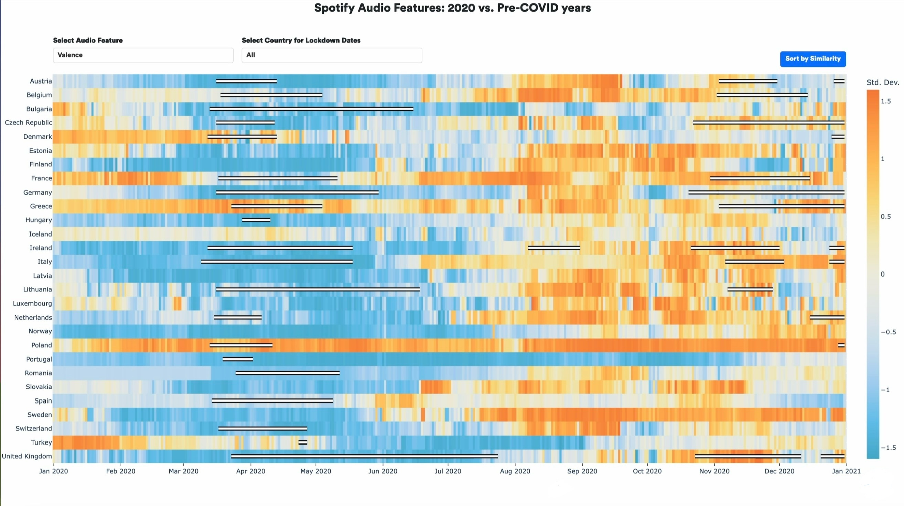

# Impact of Covid-19 on Spotify Audio Feature Trends in Europe 

## Overview

This project was developed as part of the Summer School course on Information Visualization at Aarhus University. It explores Spotify streaming data from the years 2017 to 2021, focusing on trends before and during the first wave of the COVID-19 pandemic. The goal was to create a user-driven, interactive visualization that allows users to explore and gain insights from the Spotify Charts dataset, particularly how global streaming habits shifted during this significant period.

## Project Objectives

- Analyze Spotify streaming data from 2017 to 2021, focusing on the top 200 and viral 50 tracks.
- Understand the changes in streaming habits before and during the COVID-19 pandemic.
- Create an interactive visualization to allow users to explore the data and derive their own insights.

## Dataset

We utilized the Spotify Charts dataset, available on [Kaggle](https://www.kaggle.com/datasets/dhruvildave/spotify-charts), which includes the top 200 and viral 50 tracks from 2017 to 2021. The dataset was enriched with additional audio features like danceability, tempo, and valence using the Spotify API. Note that the data crawling from Spotify was implemented in code stored in a different repository, which is not linked here.

## Data Processing

The following steps were performed during data processing:

1. Initial dataset exploration and visualization.
2. Decision to focus on the top 200 tracks from European countries.
3. Data cleaning, including the removal of countries with incomplete data (e.g., Russia and Ukraine).
4. Enrichment of the dataset with audio features using the Spotify API.
5. Data validation using Benford’s law and other statistical checks.
6. Iterative design and development of the interactive visualization.

## Interactive Visualization

The interactive visualization was created to allow users to explore the Spotify streaming data dynamically. Users can:

- View overall streaming trends across different countries.
- Drill down into specific audio features and analyze changes over time.
- Compare pre-COVID-19 and COVID-19 period data to observe changes in listening habits.

## Team

- Franziska Anna von Albedyll - Lead Developer
- Nikki Erzen - Report Author
- Aksel Thyregod Jensen - Code Contributor

## License

This project is licensed under the MIT License.
